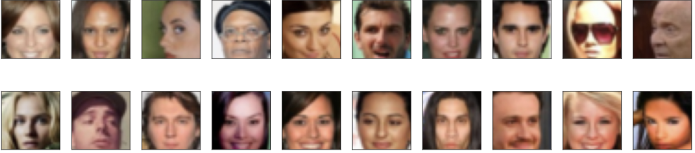
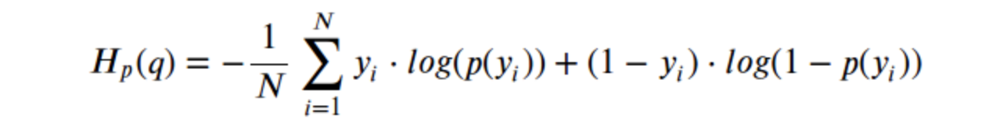
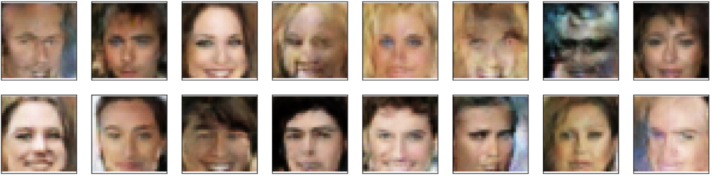

## _Generative Adversarial Nets_


## What are GANs?

Generative Adversarial Networks (GAN) is a deep learning model and one of the most promising methods for unsupervised learning on complex distributions in recent years. The model produces a fairly good output through (at least) two modules in the framework: Generative Model and Discriminative Model.

Take a simple example,

Generative Model: produce new fake currency

Discriminative Model: Given a currency, detect whether it is fake or not.

Competition in this game drives both teams to improve their methods until the counterfeits are indistiguishable from the genuine
articles.

### Work Principle

Take generating picture as an example. We have a generator G, which generates a picture marked as G(z) based on the input noise z. The input x for D, the discriminator, represents a picture, where D(x) is the probability that x is a real picture.

We train D to maximize the probability of assigning the correct label to both training examples and samples from G. We simultaneously train G to minimize
log(1 − D(G(z))):


#### DataSet
Here use the [**CelebFaces Attributes Dataset(CelebA)**](http://mmlab.ie.cuhk.edu.hk/projects/CelebA.html)

**CelebA** is a large-scale face attributes dataset with more than 200K celebrity images, each with 40 attribute annotations. The images in this dataset cover large pose variations and background clutter. CelebA has large diversities, large quantities, and rich annotations, including 10,177 number of identities, 202,599 number of face images, and 5 landmark locations, 40 binary attributes annotations per image.



First, we can resize & crop the images to a size of 32x32.

```Markdown
import numpy as np 
import pandas as pd 
import matplotlib.pyplot as plt 
import torch 
import torch.nn as nn 
import torch.nn.functional as F 
import torch.optim as optim
from torch.utils.data import DataLoader
from torchvision import datasets, transforms 

# data was extracted to this folder
dataset=datasets.ImageFolder(
    root=dataroot,
    transform=transforms.Compose([
        transforms.Resize(64),
        transforms.CenterCrop(64),
        transforms.ToTensor(),
        transforms.Normalize((0.5, 0.5, 0.5), (0.5, 0.5, 0.5)),
        ])
        )

dataloader=DataLoader(dataset,batch_size=128,shuffle=True,num_workers=2)
```


Define the weight function that to be used to the models later

```Markdown
# custom weights initialization called on netG and netD
def weights_init(m):
    classname = m.__class__.__name__
    if classname.find('Conv') != -1:
        nn.init.normal_(m.weight.data, 0.0, 0.02)
    elif classname.find('BatchNorm') != -1:
        nn.init.normal_(m.weight.data, 1.0, 0.02)
        nn.init.constant_(m.bias.data, 0)
```


#### Networks

First define the generator network. The generator generates new data instances that are "similar" to the training data, in our case celebA images. Generator takes random latent vector and output a "fake" image of the same size as the training image(3x64x64).

In practice, this is
accomplished through a series of strided two dimensional convolutional
transpose layers, each paired with a 2d batch norm layer and a relu
activation. The output of the generator is fed through a tanh function
to return it to the input data range of [-1,1]. 
        
```Markdown
class Generator(nn.Module):
    def __init__(self, ngpu):
        super(Generator, self).__init__()
        self.ngpu = 1
        self.main = nn.Sequential(
            # input is Z, going into a convolution
            nn.ConvTranspose2d(100, 512, 4, 1, 0, bias=False),
            nn.BatchNorm2d(512),
            nn.ReLU(True),
            # state size. (ngf*8) x 4 x 4
            nn.ConvTranspose2d(512, 256, 4, 2, 1, bias=False),
            nn.BatchNorm2d(256),
            nn.ReLU(True),
            # state size. (ngf*4) x 8 x 8
            nn.ConvTranspose2d(256, 128, 4, 2, 1, bias=False),
            nn.BatchNorm2d(128),
            nn.ReLU(True),
            # state size. (ngf*2) x 16 x 16
            nn.ConvTranspose2d(128, 64, 4, 2, 1, bias=False),
            nn.BatchNorm2d(64),
            nn.ReLU(True),
            # state size. (ngf) x 32 x 32 output:3x64x64
            nn.ConvTranspose2d(64, 3, 4, 2, 1, bias=False),
            nn.Tanh()
        )

    def forward(self, input):
        if input.is_cuda and self.ngpu > 1:
            output = nn.parallel.data_parallel(self.main, input, range(self.ngpu))
        else:
            output = self.main(input)
        return output
```       
    
```Markdown
netG = Generator(ngpu).to(device)
netG.apply(weights_init)
```

#### Discriminator

The discriminator evaluate the authenticity of provided images; it classifies the images from the generator and the original image. Discriminator takes true of fake images and output the probability estimate ranging between 0 and 1.

```Markdown
class Discriminator(nn.Module):
    def __init__(self, ngpu):
        super(Discriminator, self).__init__()
        self.ngpu = ngpu
        self.main = nn.Sequential(
            # input is 3 x 64 x 64
            nn.Conv2d(3, 64, 4, 2, 1, bias=False),
            nn.LeakyReLU(0.2, inplace=True),
            # state size. 64 x 32 x 32
            nn.Conv2d(64, 128, 4, 2, 1, bias=False),
            nn.BatchNorm2d(128),
            nn.LeakyReLU(0.2, inplace=True),
            # state size. (128) x 16 x 16
            nn.Conv2d(128, 256, 4, 2, 1, bias=False),
            nn.BatchNorm2d(256),
            nn.LeakyReLU(0.2, inplace=True),
            # state size. 256 x 8 x 8
            nn.Conv2d(256, 512, 4, 2, 1, bias=False),
            nn.BatchNorm2d(512),
            nn.LeakyReLU(0.2, inplace=True),
            # state size. 512 x 4 x 4
            nn.Conv2d(512, 1, 4, 1, 0, bias=False),
            nn.Sigmoid()
        )

    def forward(self, input):
        if input.is_cuda and self.ngpu > 1:
            output = nn.parallel.data_parallel(self.main, input, range(self.ngpu))
        else:
            output = self.main(input)

        return output.view(-1, 1).squeeze(1)
       
netD = Discriminator(ngpu).to(device)
netD.apply(weights_init)
```

#### Optimizer 

Here we can use ``Adam`` as the optimization algorithm for both neural networks with a learning rate of 0.0002

```Markdown
#setup optimizer
optimizerD = optim.Adam(netD.parameters(), lr=0.0002, betas=(opt.beta1, 0.999))
optimizerG = optim.Adam(netG.parameters(), lr=0.0002, betas=(opt.beta1, 0.999))
```

#### Loss Function 
With Generator and Discriminator setup, we can specify how they learn
through the loss functions and optimizers. We will use the Binary Cross
Entropy loss function



```Markdown
 ##Initialize BCELoss function
 criterion = nn.BCELoss()

 #Create batch of latent vectors that we will use to visualize the progression of the generator
 fixed_noise = torch.randn(64, nz, 1, 1, device=device)

 #Establish convention for real and fake labels during training
 real_label = 1.
 fake_label = 0.
```

#### Training

```Markdown
#Training Loop

#Lists to keep track of progress
img_list = []
G_losses = []
D_losses = []
iters = 0

print("Starting Training Loop...")
#For each epoch
for epoch in range(num_epochs):
    # For each batch in the dataloader
    for i, data in enumerate(dataloader, 0):
            
        # (1) Update D network: maximize log(D(x)) + log(1 - D(G(z))
        ## Train with all-real batch
        netD.zero_grad()
        # Format batch
        real_cpu = data[0].to(device)
        b_size = real_cpu.size(0)
        label = torch.full((b_size,), real_label, dtype=torch.float, device=device)
        # Forward pass real batch through D
        output = netD(real_cpu).view(-1)
        # Calculate loss on all-real batch
        errD_real = criterion(output, label)
        # Calculate gradients for D in backward pass
        errD_real.backward()
        D_x = output.mean().item()

        ## Train with all-fake batch
        # Generate batch of latent vectors
        noise = torch.randn(b_size, nz, 1, 1, device=device)
        # Generate fake image batch with G
        fake = netG(noise)
        label.fill_(fake_label)
        # Classify all fake batch with D
        output = netD(fake.detach()).view(-1)
        # Calculate D's loss on the all-fake batch
        errD_fake = criterion(output, label)
        # Calculate the gradients for this batch
        errD_fake.backward()
        D_G_z1 = output.mean().item()
        # Add the gradients from the all-real and all-fake batches
        errD = errD_real + errD_fake
        # Update D
        optimizerD.step()

        # (2) Update G network: maximize log(D(G(z)))
        netG.zero_grad()
        label.fill_(real_label)  # fake labels are real for generator cost
        # Since we just updated D, perform another forward pass of all-fake batch through D
        output = netD(fake).view(-1)
        # Calculate G's loss based on this output
        errG = criterion(output, label)
        # Calculate gradients for G
        errG.backward()
        D_G_z2 = output.mean().item()
        # Update G
        optimizerG.step()
```

#### Results




**References**

Ian Goodfellow, Jean Pouget-Abadie, Mehdi Mirza, Bing Xu, David Warde-Farley, Sherjil Ozair, Aaron
Courville, and Yoshua Bengio. Generative adversarial nets. In NIPS, 2014.


