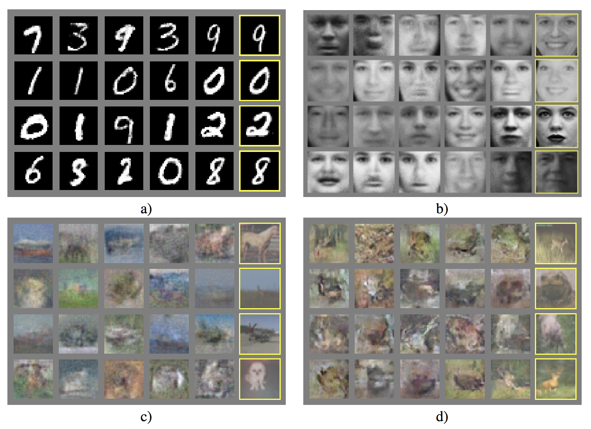

## _Generative Adversarial Nets_ and _Variational Auto-Encoders_

## What are GANs?

Generative Adversarial Networks (GAN) is a deep learning model and one of the most promising methods for unsupervised learning on complex distributions in recent years. The model produces a fairly good output through (at least) two modules in the framework: Generative Model and Discriminative Model.

Take a simple example,

Generative Model: produce new fake currency

Discriminative Model: Given a currency, detect whether it is fake or not.

Competition in this game drives both teams to improve their methods until the counterfeits are indistiguishable from the genuine
articles.

### Work Principle

Take generating picture as an example. We have a generator G, which generates a picture marked as G(z) based on the input noise z. The input x for D, the discriminator, represents a picture, where D(x) is the probability that x is a real picture.

We train D to maximize the probability of assigning the correct label to both training examples and samples from G. We simultaneously train G to minimize
log(1 − D(G(z))):

### Experiments
#### DataSet

MNIST, the Toronto Face Database(TFD), and CIFAR-10.

## Intro to VAEs

Variational Encoder VAE (Variational Auto-encoder), like GAN, has become the most popular method for unsupervised learning of complex probability distributions.
Generally, it has an encoder and a decoder.

Random samples from learned generative models of MNIST for different dimensionalities
of latent space

### Experiments

**References**

1.Ian Goodfellow, Jean Pouget-Abadie, Mehdi Mirza, Bing Xu, David Warde-Farley, Sherjil Ozair, Aaron
Courville, and Yoshua Bengio. Generative adversarial nets. In NIPS, 2014.

2.Diederik P Kingma and Max Welling. Auto-encoding variational bayes. In ICLR, 2014

