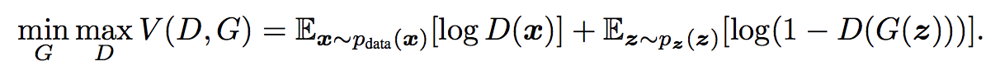
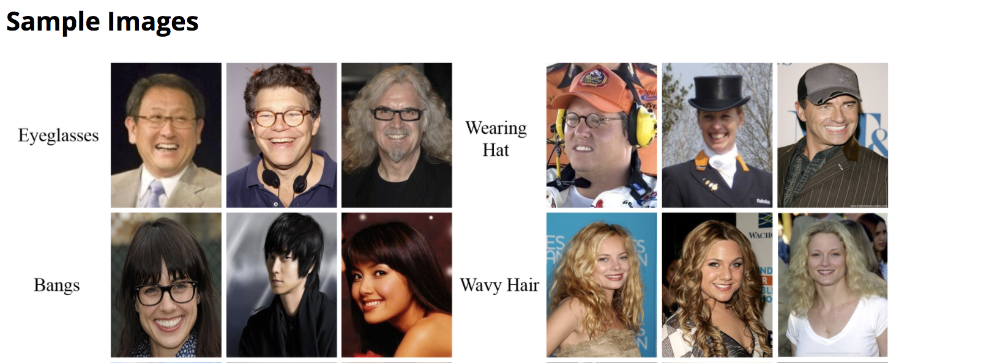

## _Generative Adversarial Nets_ and _Variational Auto-Encoders_


## What are GANs?

Generative Adversarial Networks (GAN) is a deep learning model and one of the most promising methods for unsupervised learning on complex distributions in recent years. The model produces a fairly good output through (at least) two modules in the framework: Generative Model and Discriminative Model.

Take a simple example,

Generative Model: produce new fake currency

Discriminative Model: Given a currency, detect whether it is fake or not.

Competition in this game drives both teams to improve their methods until the counterfeits are indistiguishable from the genuine
articles.

### Work Principle

Take generating picture as an example. We have a generator G, which generates a picture marked as G(z) based on the input noise z. The input x for D, the discriminator, represents a picture, where D(x) is the probability that x is a real picture.

We train D to maximize the probability of assigning the correct label to both training examples and samples from G. We simultaneously train G to minimize
log(1 − D(G(z))):



#### DataSet
Here we use the [**CelebFaces Attributes Dataset(CelebA)**](http://mmlab.ie.cuhk.edu.hk/projects/CelebA.html). It is a large-scale face attributes dataset with more than 200K celebrity images, each with 40 attribute annotations. The images in this dataset cover large pose variations and background clutter. CelebA has large diversities, large quantities, and rich annotations, including 10,177 number of identities, 202,599 number of face images, and 5 landmark locations, 40 binary attributes annotations per image.




#### Generator

Generator

##### Coding
```Markdown
class Generator(nn.Module):
    def __init__(self, ngpu):
        super(Generator, self).__init__()
        self.ngpu = ngpu
        self.main = nn.Sequential(
            # input is Z, going into a convolution
            nn.ConvTranspose2d(     nz, ngf * 8, 4, 1, 0, bias=False),
            nn.BatchNorm2d(ngf * 8),
            nn.ReLU(True),
            # state size. (ngf*8) x 4 x 4
            nn.ConvTranspose2d(ngf * 8, ngf * 4, 4, 2, 1, bias=False),
            nn.BatchNorm2d(ngf * 4),
            nn.ReLU(True),
            # state size. (ngf*4) x 8 x 8
            nn.ConvTranspose2d(ngf * 4, ngf * 2, 4, 2, 1, bias=False),
            nn.BatchNorm2d(ngf * 2),
            nn.ReLU(True),
            # state size. (ngf*2) x 16 x 16
            nn.ConvTranspose2d(ngf * 2,     ngf, 4, 2, 1, bias=False),
            nn.BatchNorm2d(ngf),
            nn.ReLU(True),
            # state size. (ngf) x 32 x 32
            nn.ConvTranspose2d(    ngf,      nc, 4, 2, 1, bias=False),
            nn.Tanh()
            # state size. (nc) x 64 x 64
        )

    def forward(self, input):
        if input.is_cuda and self.ngpu > 1:
            output = nn.parallel.data_parallel(self.main, input, range(self.ngpu))
        else:
            output = self.main(input)
        return output
```

```Markdown
netG = Generator(ngpu).to(device)
netG.apply(weights_init)
if opt.netG != '':
    netG.load_state_dict(torch.load(opt.netG))
print(netG)
```

#### Discriminator

Discriminator

##### Coding

```Markdown
class Discriminator(nn.Module):
    def __init__(self, ngpu):
        super(Discriminator, self).__init__()
        self.ngpu = ngpu
        self.main = nn.Sequential(
            # input is (nc) x 64 x 64
            nn.Conv2d(nc, ndf, 4, 2, 1, bias=False),
            nn.LeakyReLU(0.2, inplace=True),
            # state size. (ndf) x 32 x 32
            nn.Conv2d(ndf, ndf * 2, 4, 2, 1, bias=False),
            nn.BatchNorm2d(ndf * 2),
            nn.LeakyReLU(0.2, inplace=True),
            # state size. (ndf*2) x 16 x 16
            nn.Conv2d(ndf * 2, ndf * 4, 4, 2, 1, bias=False),
            nn.BatchNorm2d(ndf * 4),
            nn.LeakyReLU(0.2, inplace=True),
            # state size. (ndf*4) x 8 x 8
            nn.Conv2d(ndf * 4, ndf * 8, 4, 2, 1, bias=False),
            nn.BatchNorm2d(ndf * 8),
            nn.LeakyReLU(0.2, inplace=True),
            # state size. (ndf*8) x 4 x 4
            nn.Conv2d(ndf * 8, 1, 4, 1, 0, bias=False),
            nn.Sigmoid()
        )

    def forward(self, input):
        if input.is_cuda and self.ngpu > 1:
            output = nn.parallel.data_parallel(self.main, input, range(self.ngpu))
        else:
            output = self.main(input)

        return output.view(-1, 1).squeeze(1)
```

```Markdown        
netD = Discriminator(ngpu).to(device)
netD.apply(weights_init)
if opt.netD != '':
    netD.load_state_dict(torch.load(opt.netD))
print(netD)
```


## Intro to VAEs

Variational Encoder VAE (Variational Auto-encoder), like GAN, has become the most popular method for unsupervised learning of complex probability distributions.
Generally, it has an encoder and a decoder.


Random samples from learned generative models of MNIST for different dimensionalities
of latent space

### Experiments


**References**

1.Ian Goodfellow, Jean Pouget-Abadie, Mehdi Mirza, Bing Xu, David Warde-Farley, Sherjil Ozair, Aaron
Courville, and Yoshua Bengio. Generative adversarial nets. In NIPS, 2014.

2.Diederik P Kingma and Max Welling. Auto-encoding variational bayes. In ICLR, 2014

